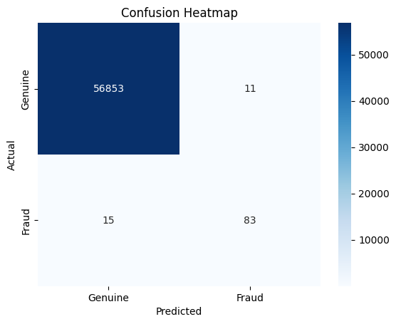
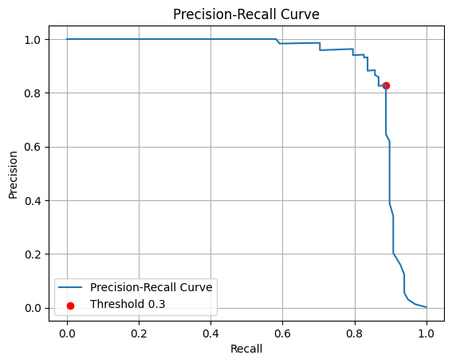

# 04 Fraud Detection ML

A machine learning project that trains a model to detect fraudulent credit card transactions using a real-world dataset from Kaggle. Built in Python as part of a portfolio project series demonstrating AI and full-stack development skills.

## Overview

Credit card fraud detection is a core challenge in fintech. This project uses a real anonymised dataset of 284,807 transactions (0.17% fraudulent) to train, tune, and evaluate a classification model. Key challenges addressed: class imbalance, choosing the right evaluation metrics, model tuning trade-offs, and building a clean data science narrative in Jupyter.

## Dataset

- Source: [Kaggle — Credit Card Fraud Detection](https://www.kaggle.com/datasets/mlg-ulb/creditcardfraud)
- 284,807 transactions — 492 fraud (0.17%), 284,315 genuine (99.83%)
- Features: Time, V1-V28 (PCA-anonymised), Amount, Class (0=genuine, 1=fraud)
- Not included in repo — download from Kaggle and place in project root as `creditcard.csv`

## Results

Three models were trained and compared:

| Model | Recall | Precision | F1 | False Negatives | False Positives |
|---|---|---|---|---|---|
| Baseline SMOTE | 0.85 | 0.88 | 0.86 | 15 | 11 |
| SMOTE + Threshold 0.3 | 0.88 | 0.83 | 0.85 | 12 | 18 |
| Class Weight Balanced | 0.73 | 0.97 | 0.84 | 26 | 2 |

**Winner: SMOTE + Threshold 0.3.** Lowest false negatives (12 fraudulent transactions missed), best recall for fraud detection where missing real fraud carries the highest financial and reputational cost. The class weight balanced model achieves the highest precision but its low recall makes it the wrong choice for this use case.

### Confusion Matrix — Baseline SMOTE Model



### Precision-Recall Curve with Threshold 0.3 Marker



See the full notebook conclusion for problem context, approach, trade-offs, and next steps.

## Concepts Demonstrated

- Pandas — loading, exploring, and preparing a real dataset
- NumPy — numerical operations underpinning ML pipeline
- Matplotlib and Seaborn — data visualisation, distribution charts, correlation heatmap, confusion matrix heatmap
- Scikit-learn — train/test split, RandomForestClassifier, classification_report, confusion_matrix, precision_recall_curve
- imbalanced-learn (SMOTE) — oversampling minority class to fix class imbalance, training-only application to prevent data leakage
- Jupyter Notebook — data story format: explore → clean → train → evaluate → tune → conclude
- Class imbalance problem — why accuracy is a misleading metric for fraud detection
- Precision, Recall, F1 Score — correct metrics for imbalanced classification
- Train/test split — evaluating model on unseen data to prevent overfitting
- Threshold tuning — `predict_proba` and custom threshold for precision/recall trade-off
- Precision-Recall curve — visual selection of optimal threshold
- Class weight balancing — alternative to SMOTE for handling imbalance
- Confusion matrix interpretation — TP, TN, FP, FN and business implications
- PCA — understanding why V1-V28 are anonymised numerical features

## Project Structure

```
04_fraud_detection_ml/
│
├── fraud_detection.ipynb    # Main Jupyter notebook — full ML pipeline
├── requirements.txt         # Core Python dependencies
├── requirements-dev.txt     # Full pip freeze for reproducibility
├── LICENSE                  # MIT licence
├── .gitignore               # Excludes venv, dataset, checkpoints
└── README.md
```

> Note: `creditcard.csv` is not committed — download from Kaggle link above.

## How to Run

```powershell
cd 04_fraud_detection_ml
venv\Scripts\activate
jupyter notebook
```

Then open `fraud_detection.ipynb` in the browser.

Requires `creditcard.csv` in the project root (download from Kaggle).

## Part of a Larger Project Series

| # | Project | Status |
|---|---------|--------|
| 01 | Finance Tracker | ✅ Complete |
| 02 | Booking System | ✅ Complete |
| 03 | Stock Dashboard | ✅ Complete |
| 04 | Fraud Detection ML | ✅ Complete |
| 05 | RAG System | ⏳ Planned |
| 06 | AI Agent | ⏳ Planned |
| 07 | Multi-Agent System | ⏳ Planned |
| 08 | AI Receptionist SaaS (Capstone) | ⏳ Planned |

---